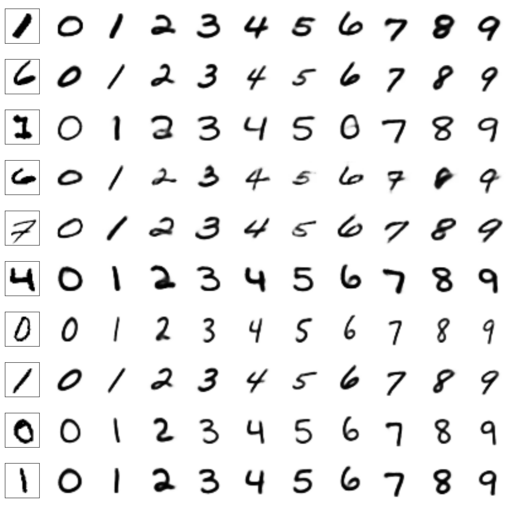

# Replication of Semi-Supervised Learning with Deep Generative Models
> Paper: [Semi-Supervised Learning with Deep Generative Models](http://arxiv.org/abs/1406.5298)
> Authors: Diederik P. Kingma, Danilo J. Rezende, Shakir Mohamed, Max Welling
> Original Implementation: [github](https://github.com/dpkingma/nips14-ssl)

Implements the latent-feature discriminative model (M1) and generative semi-supervised model (M2) from the paper in TensorFlow (python).

## Dependencies

- TensorFlow >= 0.8.0 (due to prettytensor, might work with older versions of prettytensor - not tested)
- prettytensor
- numpy
- optionally matplotlib, seaborn for VAE images

## Usage

- To train latent-feature model (M1) run train_vae.py. Parameters set in same file.
- To train M1+M2 classifier run train_classifier.py. Parameters set in same file. Location of saved M1 (VAE) model must be specified.

Example of the style and orientation learnt by the generative semi-supervised model in the latent variable (z). Generated using this implementation to replicate qualitative results from the paper.

## Credits

1. [Semi-Supervised Learning with Deep Generative Models](http://arxiv.org/abs/1406.5298)
2. [Implementation by Authors](https://github.com/dpkingma/nips14-ssl)

